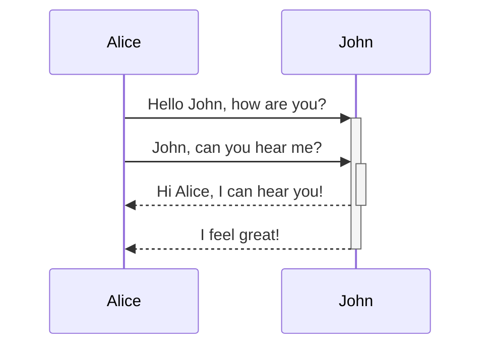

# Header 1
## Header 2
### Header 3
#### Header 4
##### Header 5
###### Header 6

---

# Text Style

*italic* _itaic_ **bold** __bold__ %%comment%% _combine **them**_ ~~cross out~~ ==highlight==

---

# Lists 

- Item 1
- Item 2
    - Item 2a
    - Item 2b

1. Item 1
2. Item 2
	1. Item 2a
	2. Item 2b

---

# Images


---

# Videos

<video data-autoplay controls width="800" height="600"><source src="https://www.w3schools.com/tags/tag_video.asp" type="video/mp4"></video>

---

<!-- .slide: id="InternalLinks" -->

# Links

You can link between slides, [like this](#/1/0).

Or by slide id, [like this](#InternalLinks).

---

# Embeds

![[Basic Markdown Syntax#Text Style]]

---

# Blockquotes

>Hello, world!

---

# Inline Code

A piece of Rust code here: `println!("Hello, world!");`

---

# Code blocks

A block of Rust code here:

```rust
fn main() -> Result<(),std::error::Error> {
	println!("Hello, world!");
}
```

---

# Tables 

this | is | a | table
---|---|---|---
this|is|a|table

---

# Footnotes

Here's a footnote [^1].

[^1]: It's here.

---

# Math

$$\begin{pmatrix}a & b \\ c & d \end{pmatrix} \cdot \begin{pmatrix}e & f\end{pmatrix} = \begin{pmatrix}ae+be & af + bf \\ ce + cf & de + df \end{pmatrix}$$

---

# Mermaid 



---

# Callouts

> [!tip] This tip has a custom Header
> This is an Tip with a custom Title
<!-- element style="width:40%"-->

> [!warning] 
> This warning is aligned left
<!-- element style="width:20%;font-size:24px" align="left"-->

<br>

> [!error] 
> Callouts support manipulation through annotations
<!-- element style="width:20%;font-size:24px" rotate="15"-->

<grid drag="30 30" drop="11 68" style="font-size:36px">
> [!example]
> Here is an Example for an Callout in a Slide. Callouts support dark and white backgrounds and could be sized by annotations
</grid>

<grid drag="50 100" drop="50 0" bg="white" pad="50px" style="font-size:36px">
> [!example]
> Here is an Example for an Callout in a Slide. Callouts support dark and white backgrounds and could be sized by annotations
</grid>

---

# [[Advanced Slides Extended Syntax]]